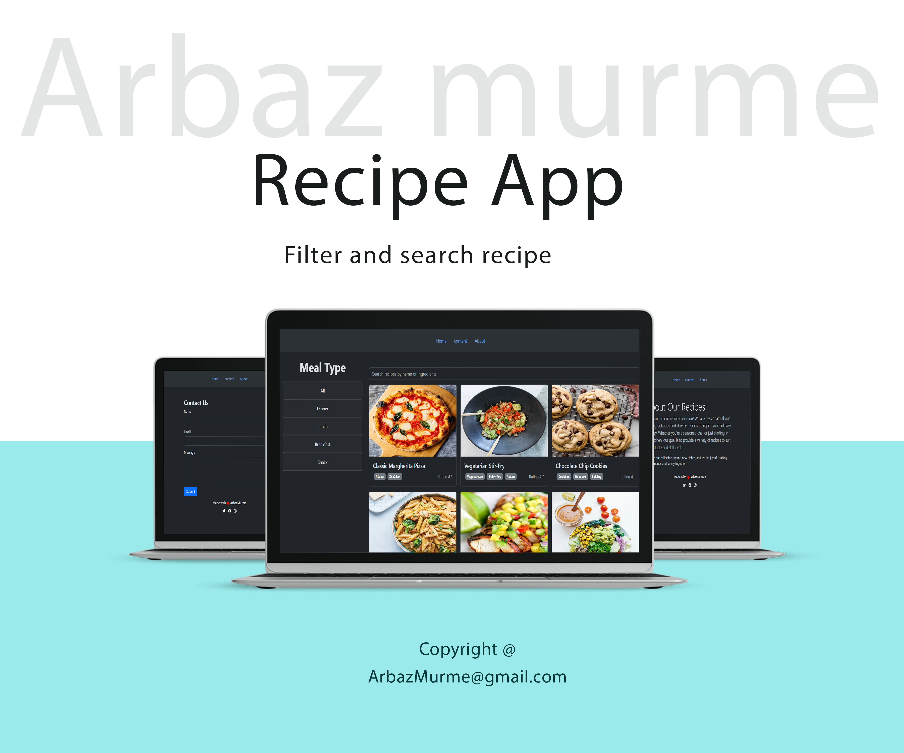

## Description
Recipe Finder is a React application for browsing, searching, and managing recipes. Features include meal type filtering, dynamic search, and responsive design.

## Live Demo

Check out the live demo [here](https://arbazmurme-recipe.netlify.app/).

## Technologies Used
- React
- React Router
- Bootstrap
- Dummy JSON data for recipes

## Installation
To run this project locally, follow these steps:
1. Clone the repository: `git clone https://github.com/yourusername/your-repository.git`
2. Navigate to the project directory: `cd your-repository`
3. Install dependencies: `npm install`
4. Start the development server: `npm run dev`

## Contributing
Contributions are welcome! Feel free to submit bug reports, feature requests, or pull requests.

## License
This project is licensed under the MIT License.

# React + Vite

This template provides a minimal setup to get React working in Vite with HMR and some ESLint rules.

Currently, two official plugins are available:

- [@vitejs/plugin-react](https://github.com/vitejs/vite-plugin-react/blob/main/packages/plugin-react/README.md) uses [Babel](https://babeljs.io/) for Fast Refresh
- [@vitejs/plugin-react-swc](https://github.com/vitejs/vite-plugin-react-swc) uses [SWC](https://swc.rs/) for Fast Refresh
